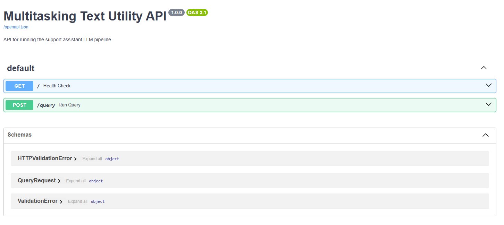
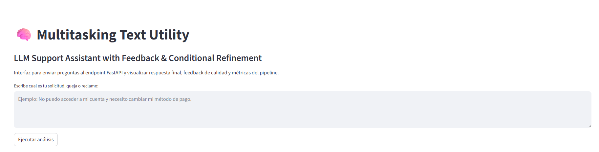
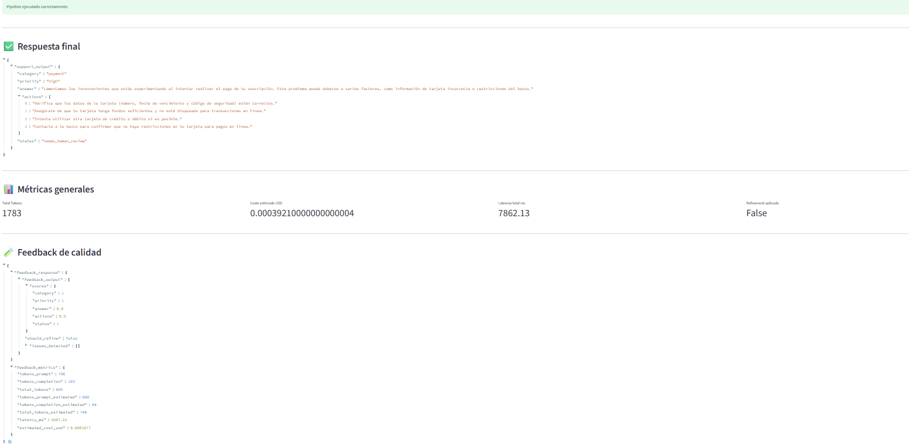
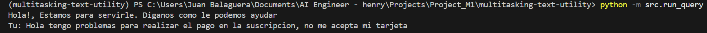

# 🧠 Multitasking Text Utility - LLM Pipeline with Feedback & Refinement

A production-oriented AI pipeline designed to process customer support requests using structured outputs, automated evaluation feedback loops, conditional refinement, observability metrics, FastAPI endpoints, and a Streamlit interface.

This project demonstrates how to move from simple LLM calls to a modular and scalable AI Engineering architecture with evaluation, optimization, cost awareness, and testing strategies.

---

## 🚀 Overview

This project implements a multi-step AI pipeline that:

1. Receives a customer support request
2. Generates an initial structured response using an LLM
3. Evaluates response quality using an automated feedback system
4. Applies conditional refinement only when necessary
5. Tracks metrics such as:
   - token usage
   - latency
   - estimated cost
   - refinement usage
6. Persists metrics for observability and future analysis
7. Exposes the pipeline through:
   - FastAPI REST API
   - Streamlit UI

---

## 🧩 Architecture

```text
User Input
    ↓
FastAPI Endpoint / Streamlit UI
    ↓
Initial LLM Response
    ↓
Feedback Evaluation (scores + issues)
    ↓
Conditional Refinement (if needed)
    ↓
Final Response
    ↓
Metrics Tracking
    ↓
CSV Persistence

```

##  ⚙️ Key Features

### ✅ Structured Output (JSON)

- Uses controlled schemas with Pydantic
- Ensures reliable downstream processing
- Defensive JSON parsing strategy
- Consistent support response format

---

### 🔁 Feedback Evaluation Loop

The pipeline evaluates response quality across:

- category classification
- priority accuracy
- answer quality
- action usefulness
- workflow status

The evaluation layer automatically generates scores between:

```text
0.0 → 1.0
```
---

### 🧠 Conditional Refinement

The system minimizes unnecessary LLM calls through conditional refinement logic.

Refinement is only triggered when:

```text
any score < 0.8
```
This helps reduce:

- token consumption
- latency
- operational cost

while maintaining response quality.

---

### 📊 Metrics & Observability

The system tracks:

- prompt tokens
- completion tokens
- total tokens
- estimated USD cost
- latency (ms)
- refinement usage

Metrics are persisted into CSV files for future analysis and observability workflows.

---

### 💰 Dynamic Model Pricing System

The project includes centralized pricing management for multiple OpenAI models.

Supported examples:

gpt-4o
gpt-4o-mini
gpt-4.1
gpt-5 family
gpt-3.5-turbo

This enables dynamic cost estimation based on:

```text
input tokens + output tokens + selected model (.env file)
```

---

### 🌐 FastAPI Backend

The project exposes a REST API using FastAPI.

Available Endpoint
POST /query

Processes a support request through the full AI pipeline.

Example request:

```json
{
  "question": "I cannot access my account and I need to update my payment method."
}
```

---

#### Swagger Documentation

Once the API is running:

```text
http://127.0.0.1:8000/docs
```

FastAPI automatically generates interactive API documentation.

---

### 🖥️ Streamlit Interface

The project also includes a Streamlit frontend that:

sends requests to FastAPI
displays final responses
visualizes metrics
shows refinement results
exposes evaluation feedback

This creates a simple production-style AI interaction layer.

---

### 🧪 Automated Tests

The project includes automated tests using pytest.

Current test coverage includes:

schema validation
pricing validation
feedback refinement rules

Example:

```bash
uv run pytest
```

Example output:

```text
================ 5 passed =================
```

---

### 📁 Project Structure

```bash
src/
├── __init__.py
├── api.py                    # 🌐 FastAPI backend
├── streamlit_app.py          # 🖥️ Streamlit frontend
├── llm_client.py             # 🤖 Initial LLM response generation
├── feedback.py               # ⚖️ Evaluation & scoring system
├── refiner.py                # 🔧 Conditional refinement logic
├── openai_runner.py          # 🏎️ Shared OpenAI execution layer
├── metrics_logger.py         # 📊 Metrics calculation
├── metrics_store.py          # 💾 CSV persistence
├── model_pricing.py          # 💰 Dynamic model pricing config
├── run_query.py              # 🚀 CLI pipeline execution
└── schema.py                 # 🏗️ Pydantic schemas

tests/
├── test_schema.py
├── test_metrics_pricing.py
└── test_feedback_rules.py

metrics/
└── metrics.csv

```

### 📊 Example Output

```json
{
  "support_output": {
    "category": "payment",
    "priority": "high",
    "answer": "We understand your concern regarding your payment issue.",
    "actions": [
      "Verify your payment method.",
      "Check if your bank blocked the transaction.",
      "Try another payment method.",
      "Contact support if the issue persists."
    ],
    "status": "needs_human_review"
  }
}
```

### 📈 Metrics Example (CSV)

```text
timestamp,user_input,total_tokens,total_cost_usd,total_latency_ms,refinement_applied
2026-04-08T10:00:00,login issue,968,0.00022,5210,true
```

---

### 🧠 Technical Highlights

- Modular AI architecture
- Production-oriented design
- Structured outputs
- Feedback-driven evaluation
- Conditional refinement pipeline
- Cost-aware execution
- Metrics observability
- Dynamic pricing abstraction
- Automated validation tests
- FastAPI backend
- Streamlit frontend
- Clean separation of concerns

---

### 🛠️ Tech Stack

- Python
- OpenAI API
- FastAPI
- Streamlit
- Pydantic
- Pytest
- Requests
- CSV persistence
  
---

## ⚡ Installation
### 1. Clone the repository

```Shell
git clone https://github.com/juanmabaal/multitasking-text-utility.git

cd multitasking-text-utility
```

### 2. Install dependencies

Using uv:

```bash
uv sync
```

Or with pip:

```bash
pip install -r requirements.txt
```

---


### 3. Configure environment variables

Create a .env file with api key and the got model you want to use:

```env
OPENAI_API_KEY=your_api_key
OPENAI_MODEL=gpt-4o-mini
```

---

### ▶️ Running the Project
Run CLI Pipeline

```Shell   
python src/run_query.py
```

---

### Run FastAPI

```Shell   
uvicorn src.api:app --reload
```

---


### Run Streamlit

```Shell   
streamlit run src/streamlit_app.py
```

---

## 📸 Screenshots

#### FastAPI Swagger Docs



---

#### Streamlit UI





---

#### CLI Pipeline Execution



---

### 💡 Future Improvements
- Retry / fallback strategies
- Multi-turn conversation memory
- Persistent database storage
- Authentication layer
- Docker support
- CI/CD integration
- Evaluation dashboards
- Real-time analytics
- Deployment to cloud providers
- Advanced observability with tracing

---

### 🧑‍💻 Author


Juan Manuel Balaguera
AI Engineer in training | Backend | LLM Systems

---

### ⭐ Key Takeaway

This project demonstrates how to evolve from simple LLM calls into a production-style AI Engineering system with:

- evaluation
- optimization
- observability
- cost tracking
- modular architecture
- automated testing
- API integration
- frontend interaction
- scalable pipeline design